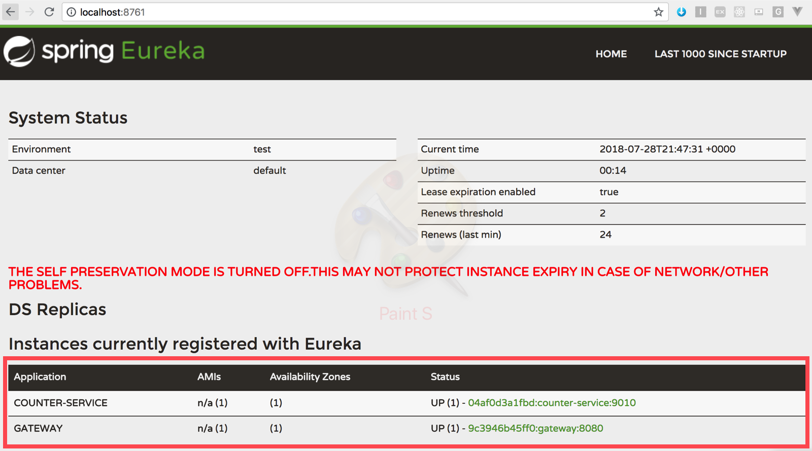
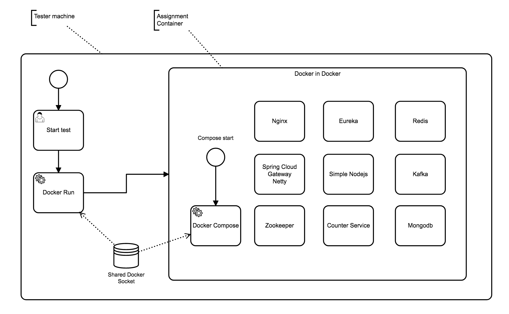
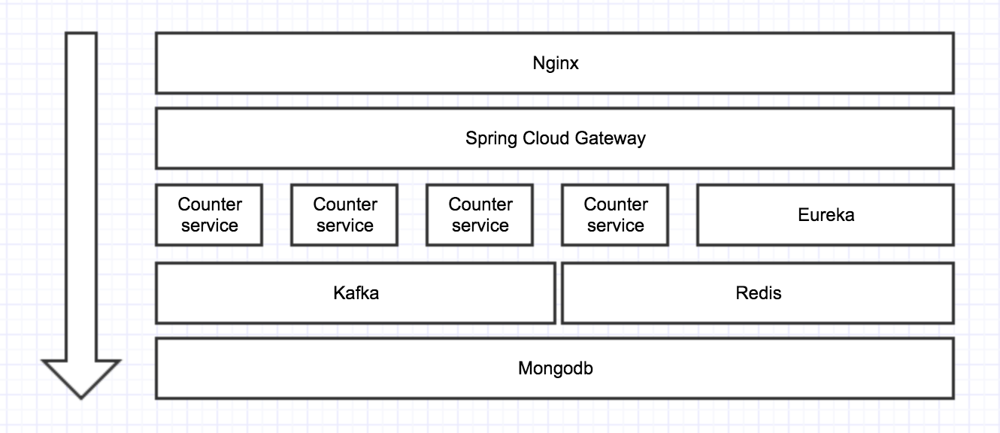

# Introduce

## Assignment

Assignment: simple counter API server based on docker

Write the code that satisfies the following conditions:
1. Produce result as described in detail in steps 1 through 6
2. All the code with the exception of shell scripts must run within Docker containers
3. Write the code in any language of your preference (Python, C++, GOLANG, etc.)
4. Write test code covered all your implementations as possible as you can.
5. Freely use services or libraries other than those suggested in below steps on your own
convenience
6. Submit the result with the followings:
a. Explain how to start your application in detail.
b. Explain what your idea of implementation is including architectural diagram
c. An archive of the hole project source directory (including the version control meta-
data such as. git directory) or Provide an URL of a private GitHub repository


## Assignment video

<iframe width="560" height="315" src="https://www.youtube.com/embed/Go7MGcnh45I" frameborder="0" allow="autoplay; encrypted-media" allowfullscreen></iframe>


## Quick Start

`System Requirements`

 - **Docker**
 - **Minimal 4GB Free Memory**

***Using Prebuilt Docker Image***

**It takes 5 to 10 minutes for the stack to fully run.**

```
$ docker run -p 3000:3000 \
-v /var/run/docker.sock:/var/run/docker.sock \
--name nexon-assignment \
--privileged --rm \
sppark/nexon-assignment:v1
```

**Test Endpoint**

After the container has started, check the list of containers on the host machine.

```
$ docker ps

CONTAINER ID        IMAGE                        COMMAND                  CREATED             STATUS              PORTS                                                NAMES
04af0d3a1fbd        project_counter-service      "java -Xmx400M -Dj..."   2 seconds ago       Up 3 seconds        0.0.0.0:32769->9010/tcp                              project_counter-service_1
9c3946b45ff0        project_gateway              "java -Xmx400M -Dj..."   3 seconds ago       Up 4 seconds        0.0.0.0:8080->8080/tcp                               project_gateway_1
5679a544d577        wurstmeister/kafka           "start-kafka.sh"         4 seconds ago       Up 4 seconds        0.0.0.0:9092->9092/tcp                               kafka-reactive-processor
d42c7d1fb562        project_eureka               "java -Xmx400M -Dj..."   6 seconds ago       Up 5 seconds        0.0.0.0:8761->8761/tcp                               project_eureka_1
89067dd16c1f        mongo:latest                 "docker-entrypoint..."   6 seconds ago       Up 5 seconds        0.0.0.0:27017->27017/tcp                             mongo
f1da08fe7629        redis:latest                 "docker-entrypoint..."   6 seconds ago       Up 4 seconds        0.0.0.0:6379->6379/tcp                               redis
44bd6dbd43e6        wurstmeister/zookeeper       "/bin/sh -c '/usr/..."   6 seconds ago       Up 5 seconds        22/tcp, 2888/tcp, 3888/tcp, 0.0.0.0:2181->2181/tcp   project_zookeeper_1
abe7932be8e5        project_nginx                "nginx -g 'daemon ..."   6 seconds ago       Up 5 seconds        0.0.0.0:80->80/tcp                                   project_nginx_1
2cdb706b1f57        sppark/nexon-assignment:v1   "/project/entrypoi..."   9 seconds ago       Up 10 seconds       0.0.0.0:3000->3000/tcp                               nexon-assignment
```

The `<nginx-ip>` location in the assignment: the ngnix port floating at `80`.

**How can I check that all of the stacks are working for test?**

open your browser [http://localhost:8761](http://localhost:8761)

As shown in the image, if both `COUNTER-SERVICE` and` GATEWAY` are in red boxes, the test is possible.



## Build Start (Optional)

 `Build Requirements`
 
  - **Maven**

***Build from source code***

```
$ cd <your-project-path>
$ mvn install
$ docker build -t sppark/nexon-assignment:v1 ./
```

## Stack configuration



- Docker compose : Tool for run stack. Run as Docker in Docker, with privileged mode and shared docker socket.
- Ngnix: Just Routing to Spring Cloud gateway
- Eureka: Service Discovery component
- Spring Cloud gateway : Netty based api gateway working with eureka.
- Counter service: A simple counter service mirco-service
- Mongodb: Entity repository
- Redis: Http Response cache repository
- Kafka: Message que for CQRS pattern
- Zookeeper: Coordinator for distributed systems. (In this example, only kafka use this)
- Node js: Just docker-compose scale commander

***Layer***



**Ports in stack**

| Stack           | Port   |
|-----------------|--------|
| redis           | 6379   |
| mongodb         | 27017  |
| kafka           | 9092   |
| zookeeper       | 2181   |
| eureka          | 8761   |
| gateway         | 8080   |
| nginx           | 80     |
| counter-service | random |


