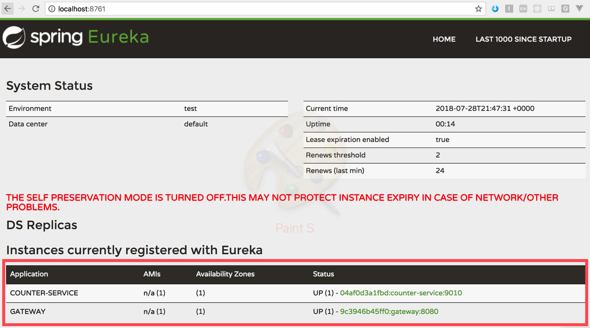

# Step1

## Assignment

`$ ./setup_api.sh 3`

If script is executed, the above line must produce the following result:

- Spawn a nginx REST-API server docker container that will listen for requests on <nginx- ip> TCP port 80
- Spawn any number of API application back-end containers given as a parameter (3 in the example) that will register themselves to the REST-API server
- When HTTP GET / is requested at the REST-API server, back-end container hostname is returned
- REST-API server is scheduling the requests to its back-end by round-robin algorithm

The following sequence of requests must produce the following result:

```shell
$ for x in `seq 1 100`; do curl -s http://<nginx-ip>/ ; done | sort | uniq 
host1
host2
host3
```

## Things to ask when testing

After execute `setup_api.sh` , please wait until all counter services are ready. 
You can check this [http://localhost:8761](http://localhost:8761).

If you do not have enough resources in your test environment to increase the number of instances, jvm will temporarily consume a lot of cpu and memory resources at boot time, causing the system to hang.
Thank you for your understanding in grading. 

## Explain

### Container orchestration

*Q. Spawn any number of API application back-end containers given as a parameter.*

**This is a question about understanding the concept of container orchestration.**

The container orchestrator should be capable of the following functions:

- Service broker / binding automation
- Resilience
- Auto Scaling
- Production debugging

`DC/OS`, `Kubernetes`, and `Docker swarm` are the right choices.

However, for minimal test environments, I have just created a docker-compose scale command.

***Flow***
 

*Client* `setup_api.sh`

```shell
#!/bin/bash
NODEJS_HOST=http://localhost:3000

curl -s ${NODEJS_HOST}?count=$1;
```

*Simple Node js* 

`index.js`

```javascript
const express = require('express')
const app = express()
const { spawn } = require('child_process');

app.get('/', (request, response) => {

    var count = request.param('count');
    console.log(count);

    const command = spawn('docker-compose', ['scale', 'counter-service=' + count]);
    command.stdout.on('data', (data) => {
        console.log(`stdout: ${data}`);
    });

    command.stderr.on('data', (data) => {
        console.log(`stderr: ${data}`);
    });

    command.on('close', (code) => {
        response.json({
            result: `child process exited with code ${code} , requested server count ${count}`
        });
    });
});

app.listen(3000)
```

### Service Self registration & Api gateway

*Q. register themselves to the REST-API server & REST-API server is scheduling the requests to its back-end by round-robin algorithm*

**This is a question about understanding the concept of service discovery and api-gateway**

I used nefflix oss microservice pattern for this.


Those minimal components working for this.

- Eureka: Service Discovery component
- Spring Cloud gateway : Api-gateway
- Counter service: A microservice


#### 1. Service discovery


**Eureka Server**

`EurekaApplication.java`

```java
@SpringBootApplication
@EnableEurekaServer ❶
public class EurekaApplication {

    private static Log logger = LogFactory.getLog(EurekaApplication.class);

    public static void main(String[] args) {
        new SpringApplicationBuilder(EurekaApplication.class).web(true).run(args);
    }

}
```
❶ Start as a eureka server.


**Counter service**

Counter service include eureka client, and in boot-up time, it will register to eureka itself.

`CounterApplication.java`

```java
@SpringBootApplication
@EnableDiscoveryClient ❶
public class CounterApplication {

    private final Log logger = LogFactory.getLog(getClass());

    public static void main(String[] args) {
        ConfigurableApplicationContext ctx = new SpringApplicationBuilder(CounterApplication.class).run(args);
    }
}
```
❶ Start including eureka client.


`application.yml`

```yml
eureka:
  client:
    registry-fetch-interval-seconds: 5
    register-with-eureka: true
    serviceUrl:
      defaultZone: http://${EUREKA_HOST}:8761/eureka/ ❶
      healthcheck:
        enabled: true
  instance:
    leaseRenewalIntervalInSeconds: 5
    leaseExpirationDurationInSeconds: 5 ❷
    statusPageUrlPath: ${server.servlet.context-path}info
    healthCheckUrlPath: ${server.servlet.context-path}health
    metadataMap:
        deployment: docker
        profile: docker
```

❶ The eureka server host to registration.

❷ This service will be unregistered if there is no response for 5 seconds. 


#### 2. Api gateway

Typically, `zuul` is used as a micro-service gateway.

However, since `zuul` does not support non blocking and socket communication, `spring cloud gateway based on netty` is getting attention. 

[https://cloud.spring.io/spring-cloud-gateway/](https://cloud.spring.io/spring-cloud-gateway/)

**gateway**

`pom.xml`

```xml
    <dependencies>
        <dependency>
            <groupId>org.springframework.cloud</groupId>
            <artifactId>spring-cloud-starter-gateway</artifactId> ❶
        </dependency>
        <dependency>
            <groupId>org.springframework.cloud</groupId>
            <artifactId>spring-cloud-starter-netflix-eureka-client</artifactId> ❷
        </dependency>
    </dependencies>
```

❶ Application start as a gateway

❷ Application know service location information from eureka server. 

`application.yml`

```yml

spring:
  cloud:
    gateway:
      discovery:
        locator:
          enabled: true
      routes: ❶
      - id: host
        uri: lb://counter-service ❷
        predicates: ❸
        - Path=/**
        filters: ❹
        - StripPrefix=0
        - AddResponseHeader=Access-Control-Allow-Origin, *
```

❶ route list

❷ proxy url. `lb://counter-service` means *counter-service* application list in eureka.

❸ input path

❹ simple pre / post filters before and after proxy

After registration, both `COUNTER-SERVICE` and` GATEWAY` are in red boxes.




