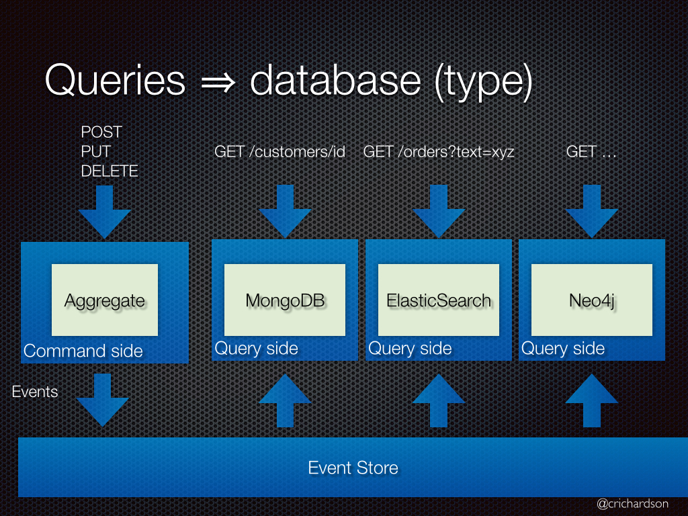
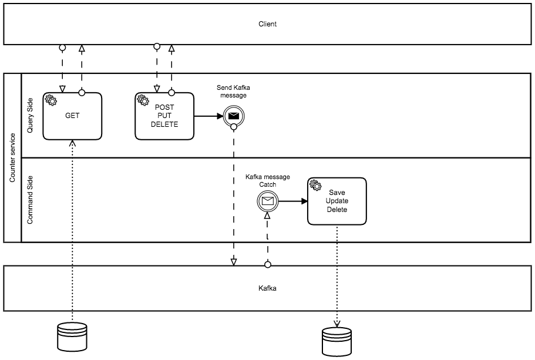
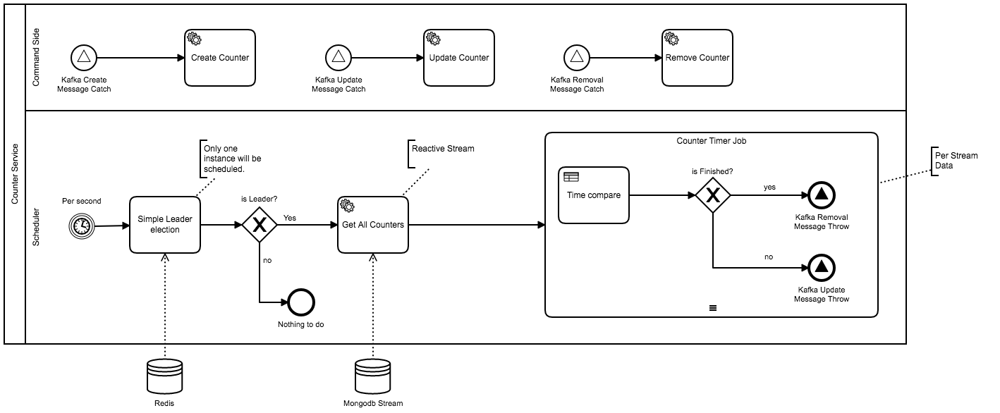
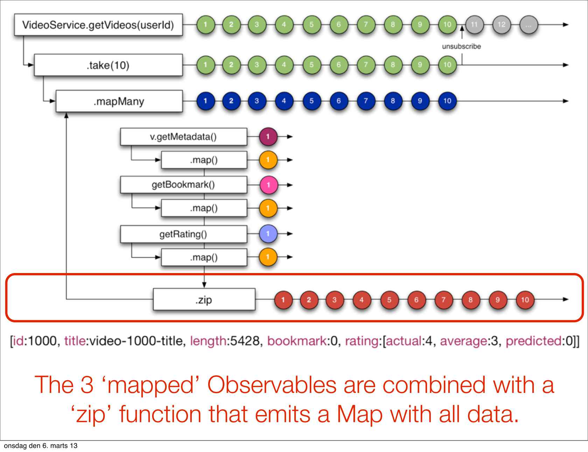

# Step2

## Assignment

A) When a `POST request to /counter` is sent with "`to`" argument, the following result will be produced:

- A counter data entity will be created whose value will increment its value by 1, each second
- A counter UUID must be returned immediately upon being created
- A counter must disappear when its value reaches 0

B) When `GET request to /counter/<UUID>` is sent, current value of a counter will be returned in JSON format as displayed below:
 
```shell
$ curl -X POST http://<nginx-ip>/counter/?to=1000 A4C2605C-5196-4815-BA26-463EB03E6C92
$ curl http://<nginx-ip>/counter/A4C2605C-5196-4815-BA26-463EB03E6C92/
{"current", 5, "to": 1000}
$ sleep 1 && curl http://<nginx-ip>/counter/A4C2605C-5196-4815-BA26-463EB03E6C92/ 
{"current", 6, "to": 1000}
```

C) Use a `create_counter.sh` script shown below to generate 1000 counters:

```shell
$ cat create_counter.sh #!/bin/sh
for x in `seq 1 100`; do
curl -X POST "http://<nginx-ip>/counter/?to=$(((RANDOM%1000)+1000))"; done

$ ./create_couter.sh
```


## Explain

*Q. Counter entity will be produced:*
- A counter data entity will be created whose value will increment its value by 1, each second
- A counter UUID must be returned immediately upon being created
- A counter must disappear when its value reaches 0

**This is a question about understanding the concept of "Scheduling Consistency in Distributed Service Environments".**

**In addition, "CQRS patterns and Non-blocking patterns" can be introduced for better design.**

The counter service should be capable of the following functions:

- Basic rest api operation
- Input and output processes are designed as non-blocking 
- Schedule time should not be affected by service processing performance.

### CQRS

**Problem**

How to implement queries in a microservice architecture?

**Solution**

Split the application into two parts: the command-side and the query-side. The command-side handles create, update, and delete requests and emits events when data changes. The query-side handles queries by executing them against one or more materialized views that are kept up to date by subscribing to the stream of events emitted when data changes.



#### Code



**Entity**

`Counter.java`

```java
@Document(collection = "counter")
@Data
public class Counter {

    @Id
    private String id;

    private String uuid;

    @Range(min = 0, max = 10000)
    private Long current;

    @Range(min = 0, max = 10000)
    private Long to;

    @CreatedDate
    private Date createdDate;
}    
```

**Repository**

`CounterRepository.java`

```java
public interface CounterRepository extends ReactiveCrudRepository<Counter, String> {

    Mono<Counter> findByUuid(String uuid);
}
```

**Kafka chanel**

Define the Kafka's input and output channels

`CounterStreams.java`

```java
public interface CounterStreams {
    String INPUT = "counter-target";
    String OUTPUT = "counter-source";

    @Input("counter-target")
    SubscribableChannel counterTarget();

    @Output("counter-source")
    MessageChannel counterSource();
}
```

`StreamsConfig.java`

```java
@EnableBinding(CounterStreams.class)
public class StreamsConfig {
    
}
```

**Kafka message**

Sets the format of the message to be input / output via Kafka.

`CounterMessage.java`

```
public class CounterMessage {
    private Counter counter;

    private String method;

    public Counter getCounter() {
        return counter;
    }

    public void setCounter(Counter counter) {
        this.counter = counter;
    }

    public String getMethod() {
        return method;
    }

    public void setMethod(String method) {
        this.method = method;
    }
}
```

**Chanel Processor**

Defines input listeners and output channel methods.

`CounterProcessor.java`

```java
@Service
public class CounterProcessor {


    @Autowired
    private CounterRepository counterRepository;

    private final Log logger = LogFactory.getLog(getClass());

    private CounterStreams counterStreams;

    public CounterProcessor(CounterStreams counterStreams) {
        this.counterStreams = counterStreams; ❶
    }

    @Async ❷
    public void sendCounterMessage(final CounterMessage counterMessage) {
        logger.info("Sending counterMessage : " + counterMessage.getMethod());

        MessageChannel messageChannel = counterStreams.counterSource();
        messageChannel.send(MessageBuilder
                .withPayload(counterMessage)
                .setHeader(MessageHeaders.CONTENT_TYPE, MimeTypeUtils.APPLICATION_JSON)
                .build()); ❸
    }

    @StreamListener ❹
    public void receiveCounterMessage(@Input(CounterStreams.INPUT) Flux<String> inbound) {
        inbound ❺
                .log()
                .subscribeOn(Schedulers.elastic())
                .subscribe(value -> { ❻
                    try {
                        CounterMessage counterMessage = new ObjectMapper().readValue(value, CounterMessage.class);
                        Counter counter = counterMessage.getCounter();
                        String method = counterMessage.getMethod();

                        switch (method) {
                            case "POST": {
                                counterRepository.save(counter)
                                        .block();
                                break;
                            }

                            case "PUT": {
                                counterRepository.save(counter)
                                        .block();
                                break;
                            }

                            case "DELETE": {
                                counterRepository.delete(counter)
                                        .block();
                                break;
                            }
                        }

                    } catch (Exception ex) {
                        
                    }
                }, error -> System.err.println("CAUGHT " + error));

    }
}
```

❶ CounterProcessor EnableBinding with Kafka Chanel Bean "CounterStreams"

❷ It should work Async, cause your system should not block the system during the event queue dispatch time.

❸ Build message and send to kafka

❹ Receive from kafka.

❺ Event comes as "Flux" stream. Flux is a stream listener declaration for non-blocking.

❻ Define what to do per each message

**Controller**

`CounterContoller.java`

```
@RestController
@RequestMapping("/counter")
public class CounterController {

    private final Log logger = LogFactory.getLog(getClass());

    @Autowired
    CounterRepository counterRepository;

    @Autowired
    CounterProcessor counterProcessor;

    @GetMapping("")
    public Flux<String> listCounterUUIds() {
        Flux<Counter> all = counterRepository.findAll();
        return all
                .log()
                .map(counter -> counter.getUuid() + "\n");
    }

    @GetMapping("/counts-all")
    public Mono<Long> counts() {
        return counterRepository.count();
    }

    @PostMapping("")
    public String sendCounterCreateMessage(@RequestParam(required = true, value = "to") Long to) {
        Counter counter = new Counter();
        counter.setTo(to);
        counter.setUuid(UUID.randomUUID().toString());

        CounterMessage message = new CounterMessage();
        message.setMethod("POST");
        message.setCounter(counter);

        counterProcessor.sendCounterMessage(message);
        return counter.getUuid() + "\n";
    }

    @GetMapping("/{uuid}")
    public Mono<ResponseEntity<Map>> getCounterSimpleFormat(@PathVariable(value = "uuid") String uuid) {
        Map map = new HashMap();
        return counterRepository.findByUuid(uuid)
                .log()
                .map(counter -> {
                    map.put("current", counter.getCurrent());
                    map.put("to", counter.getTo());
                    return new ResponseEntity<Map>(map, HttpStatus.OK);
                })
                .defaultIfEmpty(new ResponseEntity<>(new HashMap(), HttpStatus.NOT_FOUND));
    }

    @PostMapping("/{uuid}/stop")
    public ResponseEntity<String> deleteCustomer(@PathVariable("uuid") String uuid) {
        try {
            counterRepository.findByUuid(uuid)
                    .map(counter -> {
                        return counterRepository.delete(counter)
                                .subscribeOn(Schedulers.elastic())
                                .subscribe();
                    })
                    .subscribeOn(Schedulers.elastic())
                    .subscribe();
        } catch (Exception e) {
            return new ResponseEntity<>("", HttpStatus.OK);
        }
        return new ResponseEntity<>("", HttpStatus.OK);
    }
}
```

### Leaders election in a Distributed System Environment

**Problem**

Some microsystems need to control their own scheduling of their own data.

**Solution**

Let microservice choose a leader to do its own scheduling. And let's apply the cloud stream concept so that the actual operation code for the schedule can be performed by all the micro services.

#### Flow



1. Use redis lock for leader election.
2. Per second, read from mongodb stream all counters.
3. Sends a message immediately to the Kafka for each stream data.
4. All microservices receive kafka message and actual operation code is executed.

#### Code

**Leader Election**

`LeaderWrapper.java`

```java
@Service
public class LeaderWrapper {

    private static final int LOCK_TIMEOUT = 5000;
    private static final String LEADER_LOCK = "LEADER_LOCK";
    private boolean isLeader;

    @Autowired
    private String myApplicationId; ❶

    @Autowired
    private RedisTemplate redisTemplate; ❷ 

    private ValueOperations valueOperations;

    @PostConstruct
    private void init() {
        valueOperations = redisTemplate.opsForValue();
    }

    @Scheduled(fixedDelay = 2000) ❸
    public void tryToAcquireLock() {

        try {
            Object existLock = valueOperations.get(LEADER_LOCK); ❹

            //if null, set me new leader
            if (existLock == null) { ❺
                valueOperations.set(LEADER_LOCK, myApplicationId, LOCK_TIMEOUT, TimeUnit.MILLISECONDS);
                isLeader = true;
                return;
            }


            //if existLock equals myApplicationId, reset value with timeout.
            isLeader = myApplicationId.equals(existLock); ❻
            if (isLeader) {
                valueOperations.set(LEADER_LOCK, myApplicationId, LOCK_TIMEOUT, TimeUnit.MILLISECONDS);
            }

        } catch (Exception ex) {
            isLeader = false;
        }

        if (isLeader) {
            System.out.println("[" + myApplicationId + "] Now I am leader node");
        } else {
            System.out.println("[" + myApplicationId + "] It's sad being a non-leader node :-( ");
        }
    }

    public boolean amILeader() { ❼
        return isLeader;
    }

}
```

❶ Unique application id is myApplicationId

❷ Redis connection

❸ Execute Leader election code per 2 seconds

❹ Get current redis lock

❺ If lock is null, set me new leader

❻ If existLock equals myApplicationId, reset value with timeout.

❼ Services know am i leader by query this method.


**Scheduler**

`CounterScheduler.java`

```java
@Component
public class CounterScheduler {

    @Autowired
    private CounterRepository counterRepository;

    @Autowired
    private CounterProcessor counterProcessor;

    private static final Logger LOGGER = LoggerFactory.getLogger(CounterScheduler.class);

    @Autowired
    private LeaderWrapper leaderWrapper;

    @Scheduled(initialDelay = 1000, fixedDelay = 1000) ❶
    public void leaderScheduler() {
        //if not leader, skip.
        if (!leaderWrapper.amILeader()) {
            return;
        }
        try {
            this.processTimerJob();
        } catch (Exception ex) {

        }
    }

    @Async ❷
    public void processTimerJob() {
        try {
            LOGGER.info("leader processTimerJob start");

            long currentTime = new Date().getTime();
            counterRepository.findAll() ❸
                    .flatMap(counter -> {
                        CounterMessage counterMessage = new CounterMessage();
                        long diff = (currentTime - counter.getCreatedDate().getTime()) / 1000;
                        counter.setCurrent(diff); ❹

                        if (counter.getTo() <= diff) {
                            LOGGER.info("Kafka Removal Message Throw, {}", counter.getUuid());
                            counterMessage.setMethod("DELETE");
                            counterMessage.setCounter(counter);
                            counterProcessor.sendCounterMessage(counterMessage); ❺
                        } else {
                            counterMessage.setMethod("PUT");
                            counterMessage.setCounter(counter);
                            counterProcessor.sendCounterMessage(counterMessage); ❺
                        }
                        return Mono.just(counter);
                    })
                    .subscribeOn(Schedulers.elastic())
                    .subscribe(); ❻
        } catch (Exception ex) {
            LOGGER.error("leader processTimerJob failed.");
        }
    }
}
```

❶ Scheduler call "processTimerJob" every 1 seconds, if i am leader

❷ Async call processTimerJob

❸ Stream Lead Reservation from mongodb

❹ Per Stream data, time compare

❺ Send to kafka with entity operation.

❻ Subscribe the stream, work as non blocking reactor stream.

**What is reactor stream?**

Reactor is a fourth-generation Reactive library for building non-blocking applications on 
the JVM based on the Reactive Streams Specification

