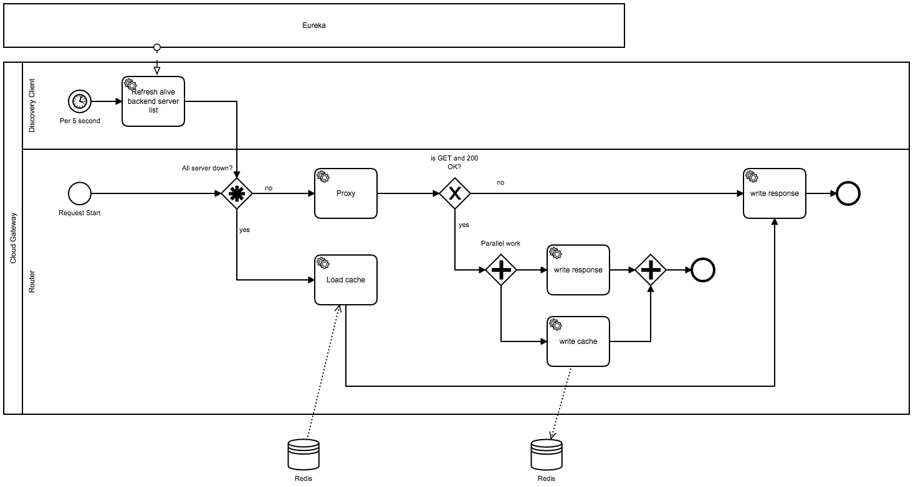

# Step4

## Assignment

Dynamically change the number of API application servers:

- Reduce the number of API application servers to 0

- Then increase it to 5

- Execute step 3 again

The counters generated in step 2) must to be preserved even when no API application servers exist

```shell
$ ./setup_api.sh 0

$ curl http://<nginx-ip>/
503 Service Unavailable

$ ./setup_api.sh 5
$ for x in `seq 1 100`; do curl -s http://<nginx-ip>/ ; done | sort | uniq host1

host2
host3
host4
host5

$ ./list_counter.sh | wc -l
100
```

## Things to ask when testing

After execute `setup_api.sh` , please wait until all counter services are ready. 
You can check this [http://localhost:8761](http://localhost:8761).

If you do not have enough resources in your test environment to increase the number of instances, jvm will temporarily consume a lot of cpu and memory resources at boot time, causing the system to hang.
Thank you for your understanding in grading.

## Explain

*Q. Reduce the number of API application servers to 0, Then increase it to 5.*

There is nothing special, and it is the same as the explanation of [Step1](Step1.md).

*Q. The counters generated in step 2) must to be preserved even when no API application servers exist.*

**This is a question about understanding the concept of api-gateway response cache.**

***Flow***
 

1. Per 5 seconds, gateway refresh alive counter-services list from eureka.
2. When request started, check if all server is down.
3. If yes, gateway load cache from redis.
4. If no, gateway proxy to counter-service
5. After proxy, if 200 ok
3. Sends a message immediately to the Kafka for each stream data.
4. All microservices receive kafka message and actual operation code is executed.

***Code***

`CacheEntity.java`

```java
@Data
public class CacheEntity {

    private String content;

    private Map<String,String> headers;
}    
```


`CacheService.java`

```java
@Service
public class CacheService {

    @Autowired
    private RedisTemplate<String, Object> redisTemplate;

    private ValueOperations valueOperations;

    @PostConstruct
    private void init() {
        valueOperations = redisTemplate.opsForValue();
    }

    public void save(String uri, byte[] content, Map headers) { ❶
        CacheEntity entity = new CacheEntity();
        entity.setContent(new String(content, Charset.forName("UTF-8")));
        entity.setHeaders(headers);

        try {
            String s = new ObjectMapper().writeValueAsString(entity);
            valueOperations.set(uri, s);
        } catch (Exception ex) {

        }

    }

    public CacheEntity load(String uri) { ❷
        try {
            String s = (String) valueOperations.get(uri);
            if (s != null) {
                return new ObjectMapper().readValue(s, CacheEntity.class);
            } else {
                return null;
            }
        } catch (Exception ex) {
            return null;
        }
    }
}
```

❶ Save cache with url key, body, headers

❷ Load cache via url key.

`CacheGlobalFilter.java`

```java
@Component
public class CacheGlobalFilter implements GlobalFilter, Ordered {

    @Autowired
    DiscoveryClient discoveryClient; ❶

    @Autowired
    CacheService cacheService; ❷

    @Override
    public int getOrder() {
        return -2; // -1 is response write filter, must be called before that
    }

    @Override
    public Mono<Void> filter(ServerWebExchange exchange, GatewayFilterChain chain) {
        //cache key
        String requestUri = exchange.getRequest().getURI().toString();
        String path = exchange.getRequest().getPath().toString();

        //All Get Method using cache logic.
        if (exchange.getRequest().getMethod().equals(HttpMethod.GET)) {
            ServerHttpResponse originalResponse = exchange.getResponse();
            DataBufferFactory bufferFactory = originalResponse.bufferFactory();

            //For certain cases, be sure registered backend servers is 0 in Eureka.
            List<ServiceInstance> instances = discoveryClient.getInstances("counter-service"); ❶
            if (instances.isEmpty()) {

                //load cache
                CacheEntity entity = cacheService.load(requestUri); ❸
                if (entity != null) {
                    ServerHttpResponseDecorator decoratedResponse = new ServerHttpResponseDecorator(originalResponse);

                    //fill body
                    DataBuffer buffer = exchange.getResponse().bufferFactory().wrap(entity.getContent().getBytes(Charset.forName("UTF-8")));

                    //fill headers
                    for (Map.Entry<String, String> entry : entity.getHeaders().entrySet()) {
                        decoratedResponse.getHeaders().add(entry.getKey(), entry.getValue());
                    }
                    exchange.getResponse().setStatusCode(HttpStatus.OK);

                    //return stream
                    return decoratedResponse.writeWith(Flux.just(buffer)); ❹
                } else {
                    return chain.filter(exchange);
                }
            } else {
                ServerHttpResponseDecorator decoratedResponse = new ServerHttpResponseDecorator(originalResponse) {

                    @Override
                    public Mono<Void> writeWith(Publisher<? extends DataBuffer> body) {

                        //if 200 status, save cache
                        if (this.getStatusCode().equals(HttpStatus.OK) && path.length() > 1) { ❺
                            if (body instanceof Flux) {
                            
                                Flux<? extends DataBuffer> fluxBody = (Flux<? extends DataBuffer>) body;

                                return super.writeWith(fluxBody.map(dataBuffer -> { ❻
                                    // probably should reuse buffers
                                    byte[] content = new byte[dataBuffer.readableByteCount()];
                                    dataBuffer.read(content);

                                    saveCache(requestUri, content, this.getHeaders().toSingleValueMap());
                                    //cacheService.save(requestUri, content, this.getHeaders().toSingleValueMap());

                                    //return non blocking stream
                                    return bufferFactory.wrap(content);
                                }));
                            }
                            return super.writeWith(body); // if body is not a flux. never got there.
                        } else {
                            return super.writeWith(body);
                        }
                    }
                };
                //return chain.filter(exchange);
                return chain.filter(exchange.mutate().response(decoratedResponse).build()); // replace response with decorator
            }
        } else {

            //Normal response
            return chain.filter(exchange);
        }
    }

    @Async
    public void saveCache(String requestUri, byte[] content, Map headers) {
        cacheService.save(requestUri, content, headers);
    }
}
```

❶ EurekaClient. Check is instances all down.

❷ Redis cache service

❸ If all down, load cache and

❹ write cache as stream

❺ If proxy response is 200 OK and GET method,

❻ The proxy response and the read cache size will operate in parallel using the same byte buffer. 